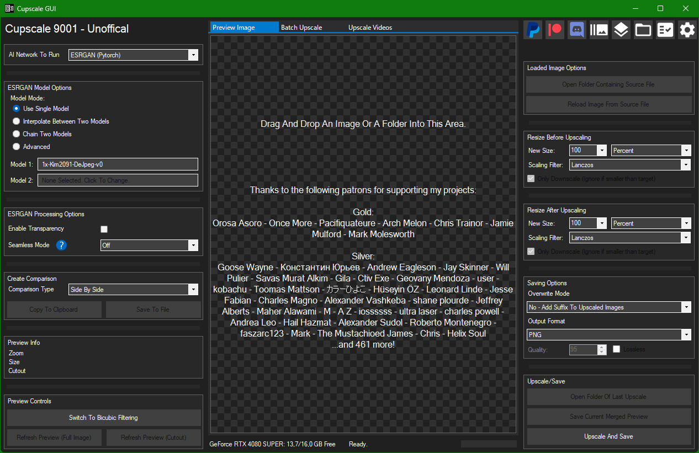

# Cupscale
Image Upscaling GUI based on ESRGAN

## Credits:

Based around [xinntao's ESRGAN](https://github.com/xinntao/ESRGAN) implemented via [Joey's Fork](https://github.com/JoeyBallentine/ESRGAN).

AMD/Intel GPU compatibility is possible thanks to BlueAmulet's [esrgan-ncnn-vulkan](https://github.com/BlueAmulet/realsr-ncnn-vulkan) based on nihui's [realsr-ncnn-vulkan](https://github.com/nihui/realsr-ncnn-vulkan) running on Tencent's [ncnn](https://github.com/Tencent/ncnn) framework, as well as [xinntao's Real-ESRGAN](https://github.com/xinntao/Real-ESRGAN).

PTH2NCNN and other features are possible thanks to [ChaiNNer](https://github.com/chaiNNer-org/ChaiNNer). 

This repo is a fork of [DrPleaseRespect's fork](https://github.com/DrPleaseRespect/cupscale) of [n00mkrad's Cupscale](https://github.com/n00mkrad/cupscale) with further fixes and ideas harvested from other forks (notably [RaaynML's cupscale_continued](https://github.com/RaaynML/cupscale_continued)) and forgotten PRs after review.

Image processing by [ImageMagick](https://imagemagick.org) via [Magick.NET](https://github.com/dlemstra/Magick.NET), video by [FFmpeg](https://ffmpeg.org) ([gyan.dev](https://www.gyan.dev/ffmpeg/builds/) builds), archives by [7-Zip](https://www.7-zip.org), CUDA upscaling by [PyTorch](https://pytorch.org).

## Download:

[Get the latest release](https://github.com/MadameMinty/cupscale/releases)

## Installation:

The application is more or less portable. It's a single executable that you can run anywhere, with no .NET installation needed (Windows x64 only).

Temporary files are stored in the installation directory by default, which is why you shouldn't install the application in protected locations like Program Files.

## Supported AI Backends:

- Nvidia CUDA (Recommended; the embedded runtime needs an RTX 20 series or newer and driver 580+)
- Vulkan (Works on any modern GPU, but is slower and takes a long time start up)
- CPU (Works without GPU, but is very slow)

## Features:

- CUDA, Vulkan/NCNN or CPU supported, with included model converter for NCNN
- On-the-fly Model Interpolation
- Model Chaining (Run images through multiple models at once)
- Batch Upscaling (Load a directory or multiple single images), keeping the folder structure
- Model Comparison in Batch mode: run images through many models and browse the results in a split-view HTML viewer
- Video Upscaling, exported as H.264, H.265 or AV1 (CPU or NVENC) with Normal/High/Lossless presets or custom FFmpeg arguments
- Automatic Image tiling/merging to avoid running out of VRAM
- Pre-Processing: Optionally downscale images before upscaling
- Post-Processing: Automatically resize after upscaling
- Compatible with PNG, JPEG, JXL, BMP, WEBP, TGA, DDS images, with inline JPEG/WebP/JXL quality and WebP/JXL lossless
- Load image straight out of the clipboard (no need to download images from web)
- Create various types of comparisons (Side-By-Side, 50/50, and before/after animations as GIF or MP4)

## Building:

- `tools/fetch-binaries.ps1` downloads FFmpeg and 7-Zip.
- `dotnet publish Code/Cupscale.csproj -c Release -p:Platform=x64` builds the executable (.NET 10 SDK).
- `tools/build-python-runtime.ps1` builds the embedded Python runtime (`py.7z`).
